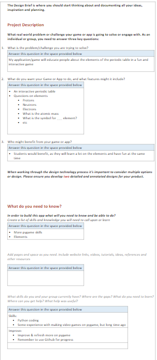

# Interactive Periodic Table

This repo contains my school project for Information Systems 2023. 

The aim is to provide an interactive periodic table to support the learning of elements.

This program uses pygame and was done is Visual Studio Code.

## Acknowledgements

* [CSV data elements](https://gist.github.com/GoodmanSciences/c2dd862cd38f21b0ad36b8f96b4bf1ee)