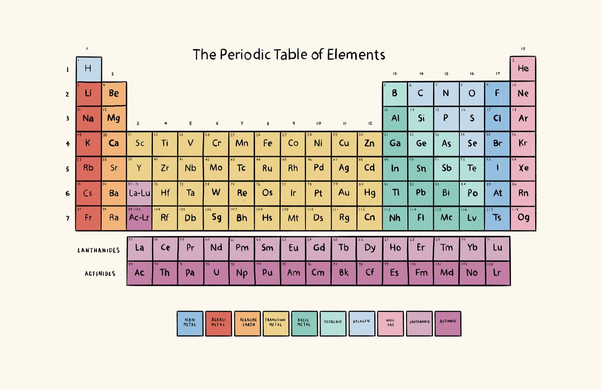

# Interactive Periodic Table

This repo contains my school project for Information Systems 2023. 

The aim is to provide an interactive periodic table to support the learning of elements.

## Acknowledgements

* [CSV data elements](https://gist.github.com/GoodmanSciences/c2dd862cd38f21b0ad36b8f96b4bf1ee)